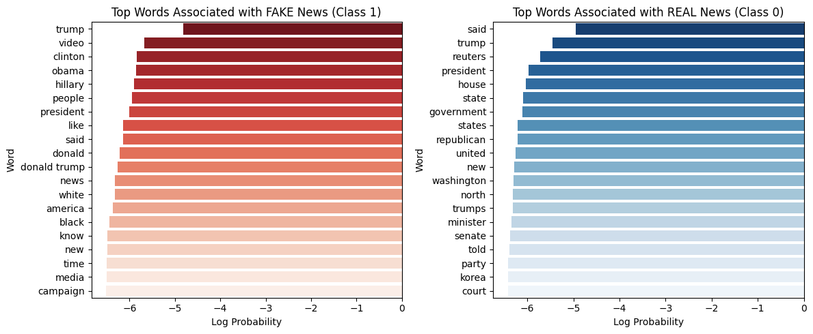

# 📰 Fake News Classifier (Naive Bayes)

This project builds a **Fake News Classifier** using a **Multinomial Naive Bayes** model.  
It predicts whether a news article is *fake* or *real* based on its text content.  
Dataset: [Kaggle Fake and Real News Dataset](https://www.kaggle.com/datasets/clmentbisaillon/fake-and-real-news-dataset)

## 📄 Project Workflow

1. **Data Loading**
   - Used Kaggle Fake/Real News dataset.
   - Saved and reloaded using Pickle for faster performance.

2. **Text Preprocessing**
   - Removed punctuation, stopwords, and converted text to lowercase.
   - Used TF-IDF vectorization.

3. **Modeling**
   - Implemented `MultinomialNB` with a Scikit-Learn Pipeline.
   - Performed hyperparameter tuning with GridSearchCV.

4. **Evaluation**
   - Accuracy: **95.3%**
   - Precision/Recall/F1: Balanced for both classes.

5. **Feature Insights**
   - Visualized top 20 words most associated with *fake* vs *real* news.
     

## ⚙️ Tools used
- Python (Pandas, NumPy)
- Scikit-Learn
- Matplotlib / Seaborn
- Google Colab

